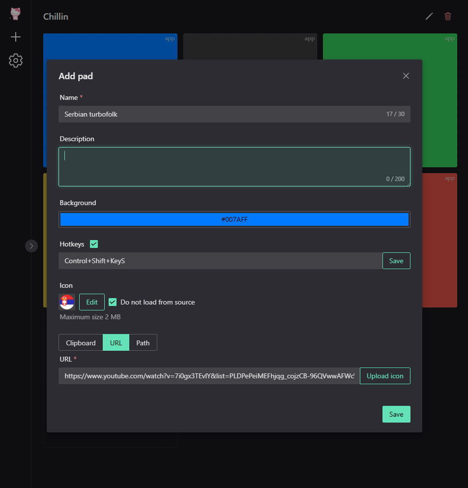
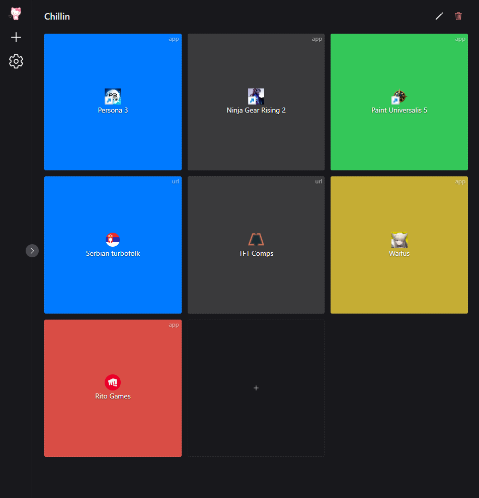

[](https://github.com/AEfimov95/deskpad/blob/main/README.ru.md)

# DeskPad

A desktop utility for organizing quick access to project files, links and snippets. 
Built with **Tauri + Vue 3**.  

[Download](#downloads) • [Development](#development)

## Features

- Copy to clipboard (HTML / plain text)
- Open links
- Open files and launch applications
- Global hotkeys support
- Drag & Drop support
- Local data storage

## Interface

<p align="center">
    
     
</p>

## Installation

Download the latest version from the [Releases](https://github.com/AEfimov95/deskpad/releases)

### Downloads

| Platform | Type | ⬇️ |
|---|---|---|
| Windows | Installer (NSIS) | [Download](https://github.com/AEfimov95/DeskPad/releases/download/v0.3.1/DeskPad_0.3.1_x64-setup.exe) |
| Windows | Installer (MSI) | [Download](https://github.com/AEfimov95/DeskPad/releases/download/v0.3.1/DeskPad_0.3.1_x64_en-US.msi) |
| Windows | Portable | [Download](https://github.com/AEfimov95/DeskPad/releases/download/v0.3.1/DeskPad_0.3.1_portable_windows_x64.zip) |
| macOS | Apple Silicon (arm64) | [Download](https://github.com/AEfimov95/DeskPad/releases/download/v0.3.1/DeskPad_0.3.1_aarch64.dmg) |
| macOS | Intel (x64) | [Download](https://github.com/AEfimov95/DeskPad/releases/download/v0.3.1/DeskPad_0.3.1_x64.dmg) |
| Linux | AppImage (x64) | [Download](https://github.com/AEfimov95/DeskPad/releases/download/v0.3.1/DeskPad_0.3.1_amd64.AppImage) |
| Linux | Deb (x64) | [Download](https://github.com/AEfimov95/DeskPad/releases/download/v0.3.1/DeskPad_0.3.1_amd64.deb) |

### System requirements

- Windows 10/11 x64
- macOS 12+ (Apple Silicon or Intel)
- Linux x64 with WebKitGTK (Ubuntu 22.04+ recommended)

### Windows

- Install or run the portable version

### macOS

- Download the `.dmg` for your architecture (Apple Silicon or Intel)
- Open the DMG and drag DeskPad to Applications

### Linux

- Download the `.AppImage`
- Make executable and run:
```
chmod +x DeskPad*.AppImage
./DeskPad*.AppImage
```

## Privacy

- No data collection
- Everything is stored locally

## Development

### Requirements

- Node 20+
- Rust (stable)
- Tauri 2

### Run in development mode

```
npm install
npm run tauri dev
```

### Build

```
npm run tauri build
```

## Tech Stack

- Tauri 2
- Vue 3
- Pinia
- Naive UI
- SQLite

## License

MIT
