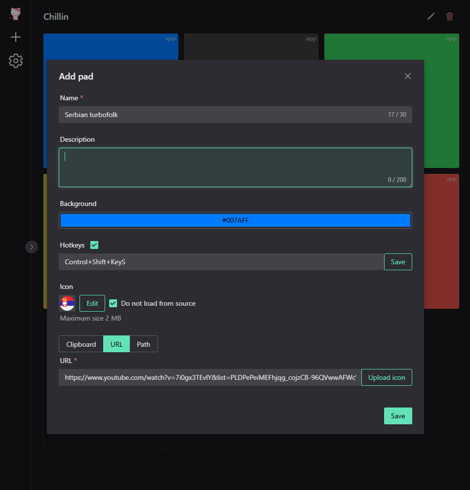
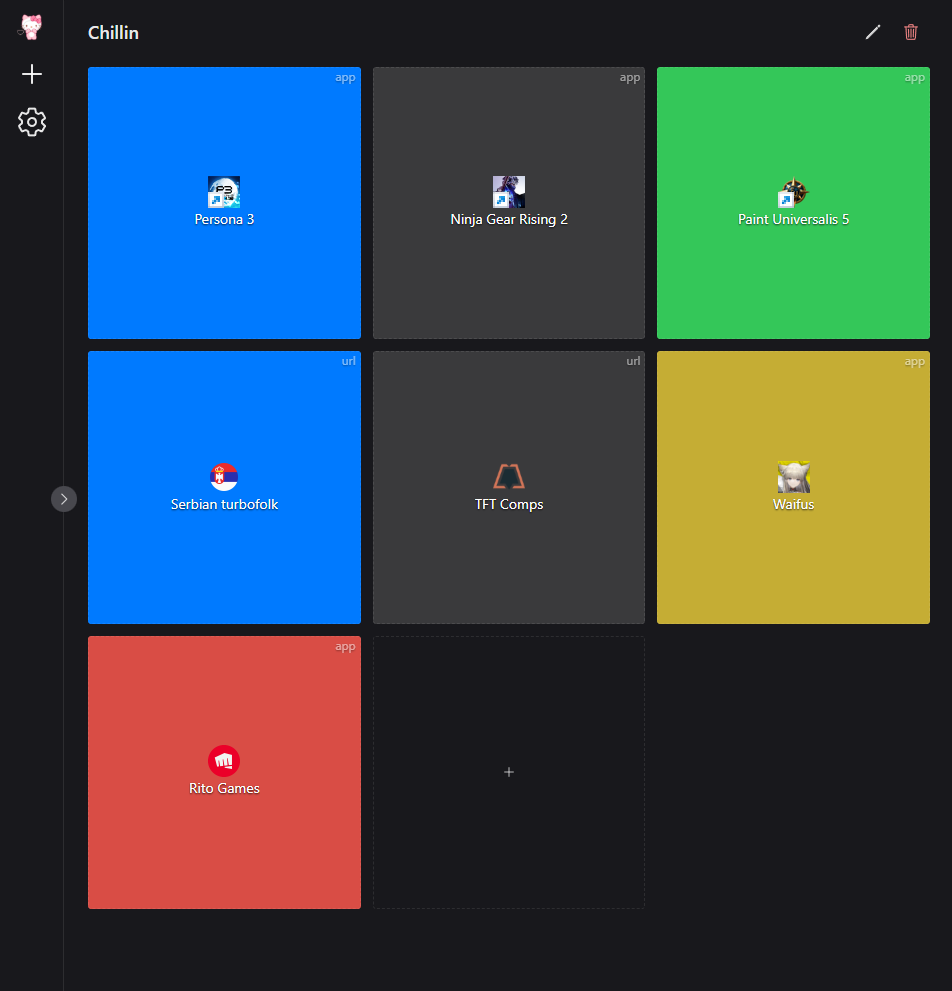

[](https://github.com/AEfimov95/deskpad/blob/main/README.md)

# DeskPad

Простое приложение для быстрого доступа к файлам, ссылкам и шаблонам.  
Разработано на **Tauri + Vue 3**.

## Возможности

- Копирование в буфер обмена (html/plain)
- Открытие ссылок
- Открытие файлов
- Поддержка глобальных горячих клавиш
- Поддержка Drag & drop
- Локальное хранение данных

## Интерфейс

<p align="center">
     
      
</p>

## Установка

Скачать последнюю версию из [раздела релизов](https://github.com/AEfimov95/deskpad/releases)

### Системные требования

- Windows 10/11 x64
- macOS 12+ (Apple Silicon или Intel)
- Linux x64 с WebKitGTK (рекомендуется Ubuntu 22.04+)

### Windows

- Установите приложение или запустите portable-версию

### macOS

- Скачайте `.dmg` для вашей архитектуры (Apple Silicon или Intel)
- Откройте и перетащите DeskPad в «Applications»

### Linux

- Скачайте `.AppImage`
- Сделайте файл исполняемым и запустите:
```
chmod +x DeskPad.AppImage && ./DeskPad.AppImage
```

## Приватность

- Не собирает и не отправляет данные
- Локальное хранение

## Разработка

### Требования

- Node 20+
- Rust (stable)
- Tauri 2

### Запуск в режиме разработки

```
npm install
npm run tauri dev
```

### Сборка приложения

```
npm run tauri build
```

## Стек

- Tauri 2
- Vue 3
- Pinia
- Naive UI
- SQLite

## Лицензия

MIT
